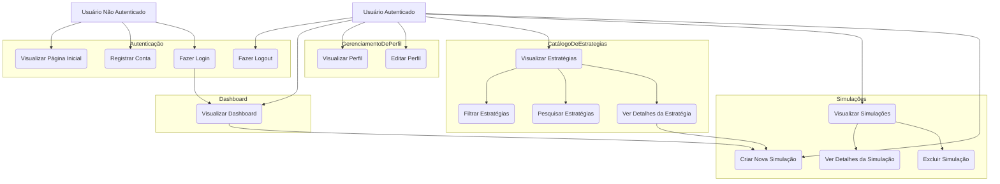
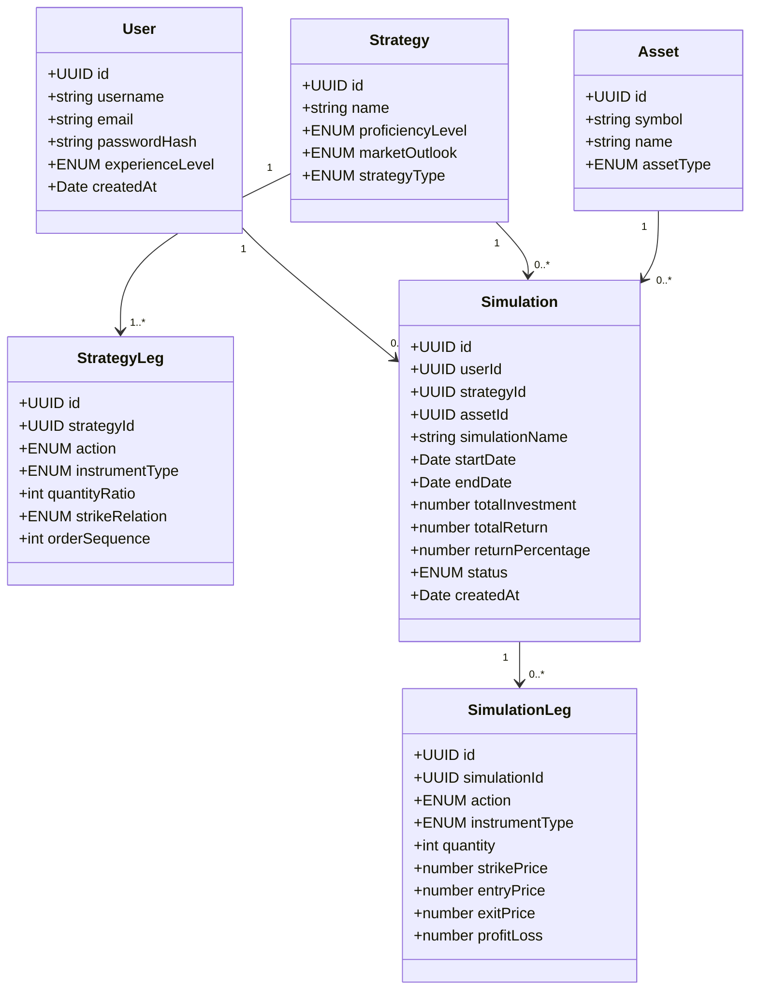
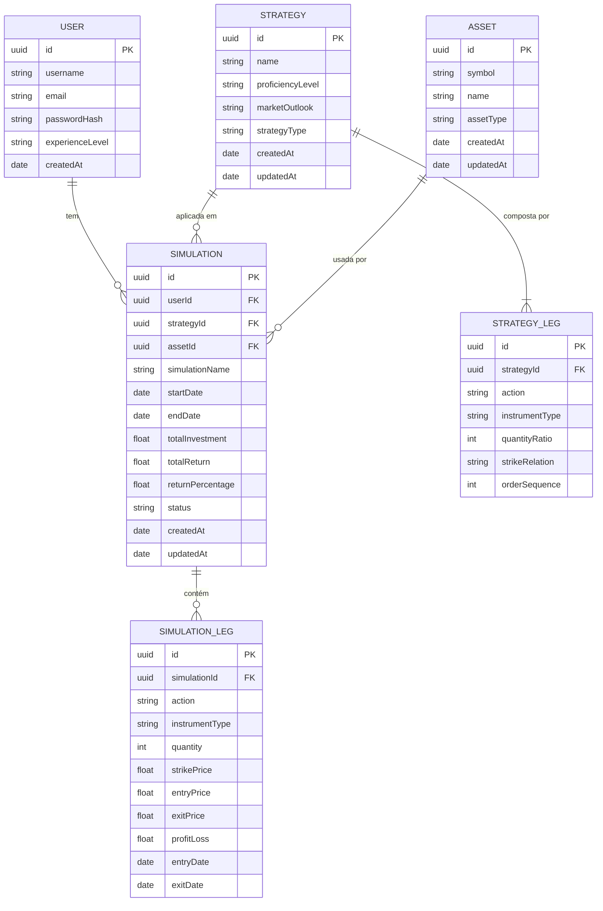
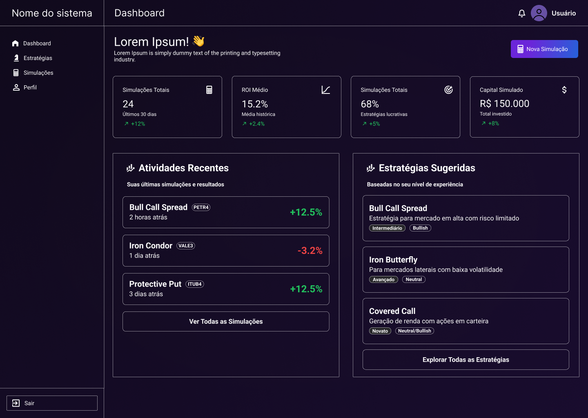
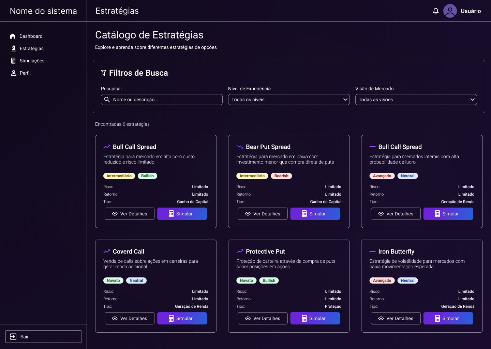
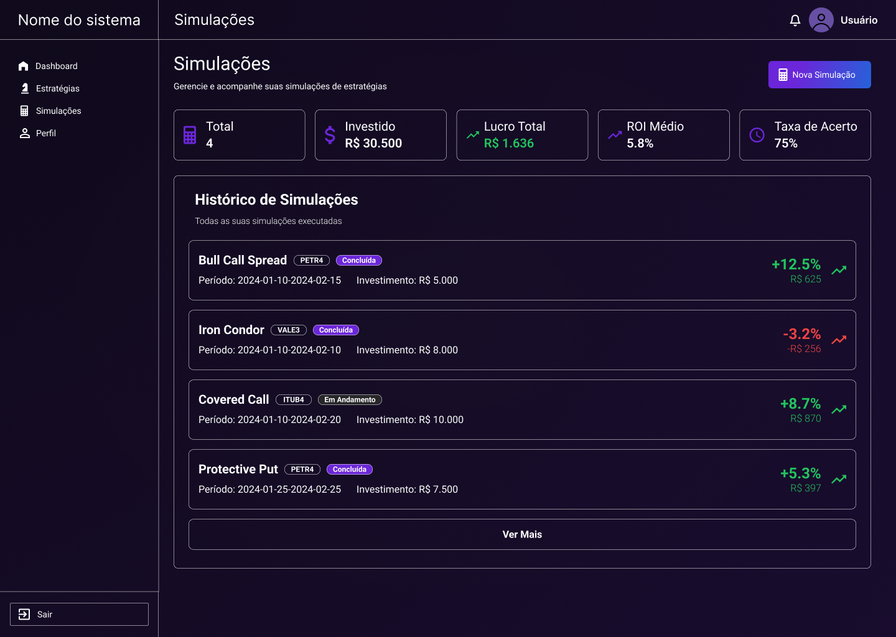
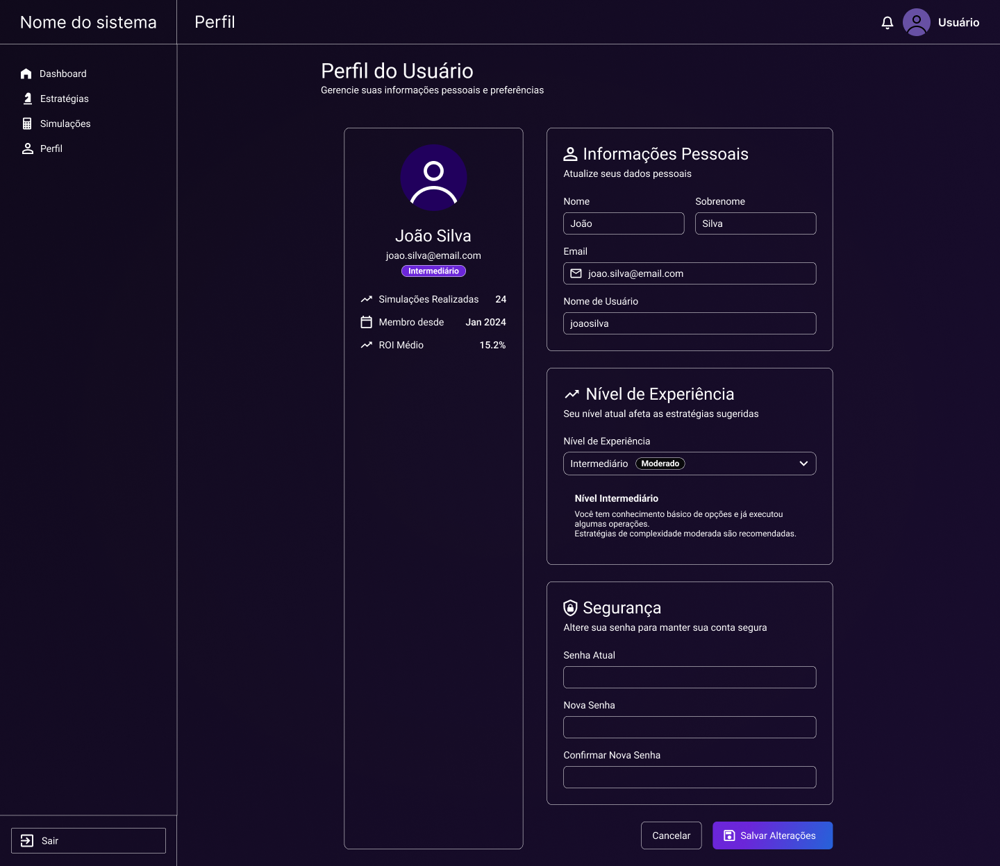

# Sistema de Estratégias de Opções

## Proposta do Projeto

Este projeto visa desenvolver um sistema web abrangente para **análise, simulação e aprendizado de estratégias de opções financeiras**, com base nos princípios e estratégias detalhadas no livro "The Bible of Options Strategies" de Guy Cohen.

Nosso objetivo é criar uma ferramenta intuitiva e poderosa que capacite tanto investidores iniciantes quanto experientes a explorar, entender e simular o desempenho de diversas estratégias de opções em diferentes cenários de mercado.

## Ideia Central

A ideia central é democratizar o acesso ao conhecimento sobre opções, transformando conceitos complexos em funcionalidades práticas e visuais. O software permitirá aos usuários:

1.  **Explorar um Catálogo de Estratégias:** Filtrar e pesquisar estratégias de opções por nível de experiência, perspectiva de mercado (alta, baixa, neutra) e perfil de risco/retorno.
2.  **Simular Desempenho:** Testar o resultado de estratégias com dados históricos de ativos, visualizando o lucro/prejuízo potencial e métricas de performance.
3.  **Visualizar Perfis de Risco:** Entender graficamente o perfil de risco e retorno de cada estratégia, incluindo pontos de equilíbrio e impacto dos "Greeks" (Delta, Gamma, Theta, Vega, Rho).

## 🛠️ Stack Tecnológica (MVP)

-   **Backend:** Node.js (Nest.js, TypeScript)
-   **Frontend:** React (TypeScript, Material-UI)
-   **Banco de Dados:** PostgreSQL
-   **Dados de Mercado:** Integração com APIs de dados históricos (ex: Yahoo Finance)

## 📈 Funcionalidades do MVP

-   Autenticação e gerenciamento de usuários.
-   Catálogo de estratégias com filtros avançados.
-   Simulador básico de estratégias com dados históricos.
-   Visualização de resultados de simulação.
-   Dashboard pessoal para acompanhar simulações.

Este projeto não apenas serve como uma ferramenta educacional e analítica, mas também demonstra a aplicação de tecnologias web modernas e boas práticas de desenvolvimento de software.

## Diagrama de Casos de Uso (MVP)

Para representar as principais interações do usuário com o sistema, elaboramos o seguinte **diagrama de casos de uso**.  
Ele mostra as funcionalidades disponíveis para **usuários autenticados** e **não autenticados**, bem como a relação entre os diferentes módulos do sistema (autenticação, perfil, catálogo de estratégias, dashboard e simulações):

## Diagrama de Classes (Versão Inicial - MVP)

Este diagrama representa as entidades principais do sistema (MVP), mantendo apenas as classes essenciais para autenticação, catálogo de estratégias e simulação básica.

### Detalhamento das Entidades (MVP)

- **User**: Representa os usuários do sistema. Cada usuário pode autenticar-se, acessar o catálogo de estratégias e criar simulações.  
- **Strategy**: Conjunto de regras pré-definidas de operações de opções financeiras (ex: Long Call, Covered Call).  
- **StrategyLeg**: Define cada perna da estratégia (compra/venda de CALL, PUT ou ação) e sua proporção.  
- **Asset**: Ativo subjacente usado nas simulações (ações, ETFs, índices, etc.).  
- **Simulation**: Execução de uma estratégia aplicada a um ativo em um período histórico, contendo os resultados (lucro/prejuízo).  
- **SimulationLeg**: Detalha cada operação concreta da simulação (preço de entrada, saída, quantidade, P&L).

## DER do Banco de Dados (MVP)

O diagrama abaixo representa o modelo lógico do banco para o MVP, alinhado às entidades do sistema (User, Strategy, StrategyLeg, Asset, Simulation e SimulationLeg) e seus relacionamentos.

## Protótipo das Telas (Figma)

O protótipo de interface foi desenvolvido no **Figma**, contemplando as principais telas do sistema.

### Pré-visualização

| Página Inicial | Dashboard | Catálogo de Estratégias |
|---|---|---|
|  |  |  |

| Simulações | Perfil do Usuário |
|---|---|
|  |  |
